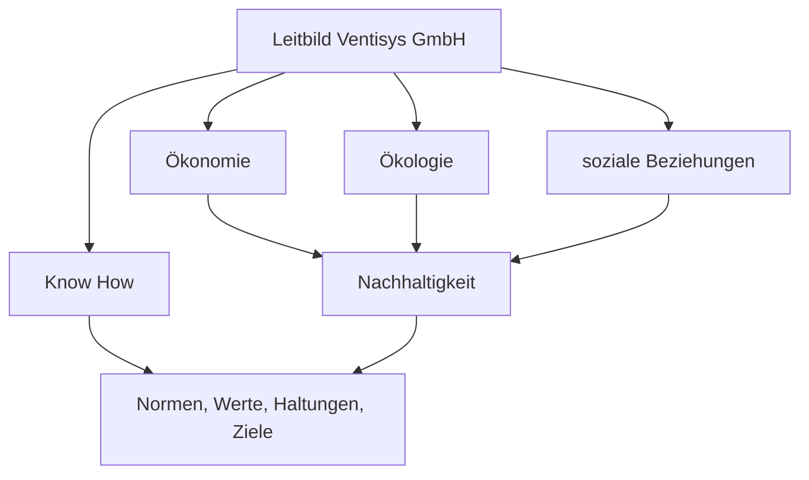
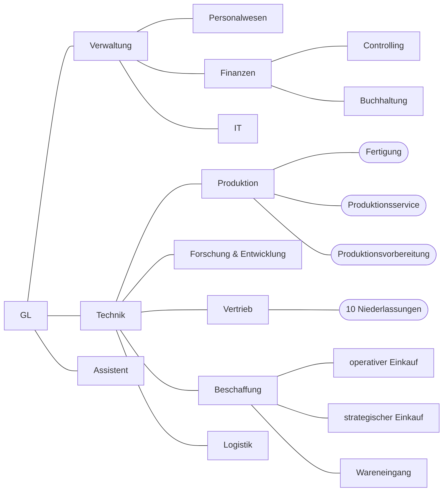
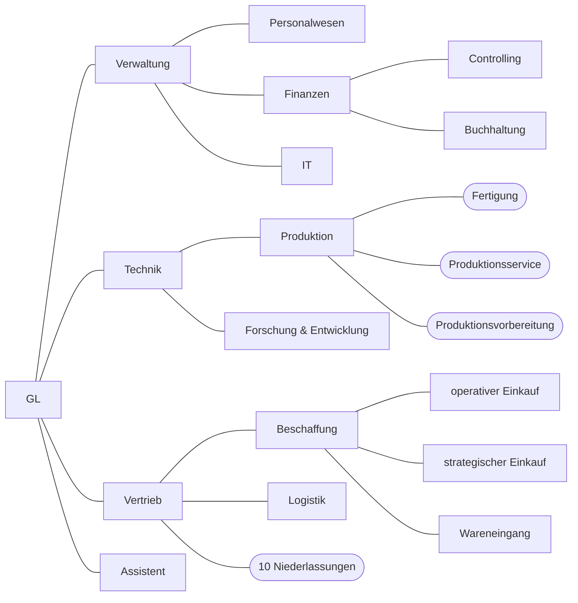

## Ausgangssituation (fiktives Unternehmen):
![[Pasted image 20231121115226.png]]  
![[Pasted image 20231121115237.png]]  

1.Frage: **4 Punkte** 
   Das Unternehmen sieht sich in einer modernen gesellschaftlichen Verantwortung. Deshalb möchte dies das Unternehmen in einem attraktiven Unternehmensleitbild zur Orientierung und Motivation nach innen und außen darstellen. Skizzieren sie ein solches Leitbild und benennen die einzelnen Elemente.

2.Frage: **21 Punkte**
a.) Stellen sie das Unternehmen als Organigramm dar und beschriften die einzelnen Funktionseinheiten. (8 Punkte)
Leders Lösung:

Unsere Lösung (die Einzigwahre):

b.) Auf Grund der Größe des Geschäftsbereiches Technik benötigen sie Bereiche und Abteilungen die teilautonom arbeiten. Erläutern sie drei Vorteile der Einführung von dezentraler Führung von funktionalen Betriebsteilen. (3 Punkte)
- Entscheidungen dort wo sie Auswirkungen haben
- schnellere Entscheidungen
- Entlastung der übergeordneten Organisationseinheit
- Spezialisten vor Ort, treffen die Entscheidungen

c.) Schlagen sie einen Bereich vor, in dem bei den Abteilungen die größte Effektivität durch dezentrale Führung erzielt werden kann. Benennen sie die Unternehmensform und begründen sie ihre Entscheidung. (4 Punkte)
- Vertrieb
	- weil so der Informationsfluss beschleunigt werden kann, hierbei können die einzelnen Niederlassungen Teilautonom sein, da sie so nicht mehr auf Hanau angewiesen sind.
- Unternehmensform: sekundär, Center-Organisation, Profit-Center (unser Meinung nach: Revenue-Center)
	- Vertrieb verkauft die Produkte und erzielt somit hauptsächlich Gewinne, um welche sich der Bereich als Profit-/(Revenue-)Center selber kümmern kann, um diese schneller zu maximieren.

d.) Um das selbständige Handeln der Abteilungen zu fördern, benötigen die Mitarbeiter ein Führungsinstrument, dass ihnen die Grundlage eigenverantwortlicher Arbeit ermöglicht. Nennen und beschreiben sie die Bestandteile dieses Führungsinstrumentes. (6 Punkte)
- Stellenbeschreibung --> Beschreibung für das selbstständige Handeln
	- Aufgabenbeschreibung
		- Bezeichnung, Aufgaben, Ziele, Befugnisse, Verantwortung
	- Anforderungen
		- Fähigkeiten, Fertigkeiten, Kenntnisse (persönlich, methodisch, fachlich), Erfahrungen

3.Frage: **20 Punkte**
a.) Um die gesteckten Umsatz- und Rentabilitätsziele zu verwirklichen, ist ein hochmotivierter Personalbestand im gesamten Unternehmen notwendig. Mit welchem Mittel können sie Mitarbeiter langfristig motivieren. Beschreiben sie die Elemente! (5 Punkte)
- faires Entgelt, Work-Life-Balance, Anerkennung / Integration, Förderung / Entwicklung, gutes Betriebsklima

b.) Das Unternehmen hat einen von den Kunden erwarteten Qualitätsstandard erreicht, den es zu halten gilt und auszubauen ist. Dafür ist der aktuelle Personalbestand auf den Prüfstand zu stellen. In regelmäßigen Beurteilungen haben sie festgestellt, dass im Bereich der Niederlassungen 30 Quereinsteiger in der Vergangenheit angelernt wurden und kaufmännisches und technisches Knowhows nicht dem aktuellen Stand entsprechen. Schlagen sie der Geschäftsleitung zwei Maßnahmen vor, die diesen Stand kurz und mittelfristig ändern können. (4 Punkte)

| kurzfristig             | mittelfristig |
| ----------------------- | ------------- |
| Seminare                | Ausbildung    |
| Recruitung / Entlassung | Studium       |

c.) Zur Gewährleitung, dass die Mitarbeiter keiner permanenten Überlastung ausgesetzt sind, erwägen sie den Personalbestand neu zu berechnen. Sie nutzen hierzu die Netto-Personalbedarfsrechnung für einen Zeitraum von drei Jahren. Aus ihren Recherchen im Bereich des Personalwesen haben sie folgende Erkenntnisse gewonnen; sie erwarten, dass sie lediglich die Hälfte der Ingenieure und Facharbeiter einstellen können. Für die Umsatzziele sind weitere Mitarbeiter im Vertrieb, Produktion, Service und Personalwesen notwendig. Es gibt aktuell keine Vakanzen. Folgende Stellen sollen zusätzlich besetzt werden: 1x Personalwesen, 8x Produktion, 7x Vertrieb und 4x Service. Sie planen mit einem zusätzlich gesicherten Zugang (Elternzeit, Azubi-Übernahme) von 19 Personen und werden mit Sicherheit 27 Personen als Abgang (Ruhestand, Vorruhestand) haben. Des Weiteren schätzen sie ein, dass weitere 6 Mitarbeiter das Unternehmen sicher verlassen werden (Kündigung). (8 Punkte)
![[Pasted image 20231121140425.png]]
- In den nächsten 3 Jahren müssen zusätzlich 34 MA eingestellt werden

d.) Aufgrund der Größe des Unternehmens sind die Führungskräfte in der Produktion oft überlastet. Nennen sie eine Möglichkeit, die Führungskräfte in ihrer operativen Arbeit zu entlasten und beschreiben sie das Ergebnis! (3 Punkte)
- Einstellung weiterer Führungskräfte --> Entlastung durch Aufgabenteilung untereinander

4.Frage: **8 Punkte**
a.) Sie haben die Voraussetzungen der Unternehmensorganisation im Aufbau inhaltlich erreicht. Jetzt wollen sie das Marketing verbessern, um die Ziele des Unternehmens zu erreichen. Beschreiben sie die zwei Marketingstrategien und schlagen sie eine für das Unternehmen vor, Begründen sie ihre Entscheidung. (4 Punkte)

| Push-Marketing                                         | Pull-Marketing |
| ------------------------------------------------------ | -------------- |
| Versuch eine neue Technologie auf den Markt zu bringen | Technologie nach Wunsch des Marktes               |
- Pull-Marketing, da die Gesellschaft hohe Anforderungen an Kühlsysteme hat, insbesondere in Sachen Umwelt, durch eine Analyse kann die mögliche Kundschaft gezielter aufgegriffen werden. 

b.) Beschreiben sie die vier Säulen des Marketings und deren Bedeutung für den Erfolg des Unternehmens (4 Punkte)

| Kommunikation | Produkt    | Kontrahierungspolitik | Distribution |
| ------------- | ---------- | --------------------- | ------------ |
| Werbung       | BCG-Matrix | Preis                 | Vertrieb     |
| Veröffentlichung Produkt / Dienstleistung              |            |                       |              |

5.Auf Grund des permanenten Kostendrucks benötigen sie effektive Mittel zur Steuerung/Regelung von Prozessen. Nennen und erläutern sie ein Kennzahlensystem, welches ihnen einen guten und schnellen Überblick über verschiedene Kennzahlen ermöglicht und geeignet ist, schnelle Entscheidungen zu treffen! (3 Punkte)
- Dashboard mit Ampelsystem
	- schnelle Übersicht über die Kennzahlen
	- einfache Einschätzung der Situation (rot = kritisch, gelb = Obacht, grün = alles ok)

6.Frage: **12 Punkte**
   Sie haben die Aufgabe, zur nachhaltigen Führung des Unternehmens die Balance-Score-Card (BSC) im Unternehmen zu implementieren. Das Unternehmen hat bisher keine Erfahrung mit dem Einsatz des neuen Steuerungselements.
a.) Beschreiben sie die Führungsmethode zur effektiven Implementation der BSC! (8 Punkte)
- PDCA (Achtung mit Erklärung!) (weil was neues eingeführt werden soll)

b.) Beschreiben sie den Inhalt der Anwendung der BSC an dem Beispiel der langfristigen Erweiterung
des Angebotes um 10% in qualitativer Hinsicht und die Auswirkungen auf die einzelnen Elemente! 
(4 Punkte)
- interne Geschäftsperspektive (MR) --> neuere Maschinen
- Innovation / Lernperspektive (HR) --> Schulung- / Qualitätssicherung
- finanzielle Perspektive (FR) --> Kosten, Gewinn $\uparrow$   
- Kundenperspektive (Kunde) --> Kundenzufriedenheit $\uparrow$ 

7.Frage: **17 Punkte**
Sie sehen für die weitere Entwicklung des Unternehmens im Internationen Maßstab interne und
externe Risiken. Sie führen eine kontinuierliche Beurteilung der Mitarbeiter anhand des Anforder-
der Stellenbeschreibung ein. Es gibt auf Grund des altersbedingten Ausscheidens einer Führungskraft eine Vakanz. Einer der Mitarbeiter zeichnet sich durch besonders gute Arbeit und das Potential zur Führungskraft aus. Seine fachlichen, methodischen und persönlichen Kompetenzen sind für eine verantwortliche Position geeignet, jedoch fehlt der Ausbilderschein der im Unternehmen verpflichtend für Führungskräfte festgelegt ist.
Sie erwägen eine interne und öffentliche Ausschreibung für eine möglichst große Auswahl an
Bewerbern.
a.) Erstellen sie eine SWOT-Analyse für den MA der möglicherweise die Vakanz ausfüllen soll.
Tragen sie die aktuellen Bedingungen ein! (4 Punkte)
b.) Treffen sie Schlussfolgerungen/Maßnahmen aus den Bedingungen, die der Mitarbeiter erfüllen
sollte! (8 Punkte)

|                                                      | Stärken - im Unternehmen - hat alle notw. Kompetenzen                                                   | Schwächen - fehlender Ausbildungsschein |
| ---------------------------------------------------- | --------------------------------------------------------------------------------------------------------- | ---------------------------------------- |
| Chancen - Vakanz ist zu schließen                   | Bewerbung - Info an das Unternehmen --> Wille                                                            | Ausbilderschein machen                   |
| Risiken - Ausschreibung mögliche andere Bewerber | - Stärken unter Beweis stellen - vergangene Erfolge aufzeigen - gute Vorbereitung auf die Tests / Auswahl | - Vorbereitung auf weitere Bildungsmaßnahmen - besten Ausbilderschein                                         |

c.) Formulieren sie ein Ziel für den Mitarbeiter! (5 Punkte)
- S --> Ausbilderschein machen
- M --> Schein mit Note 1 bestehen
- A --> zugelassene Weiterbildung / Vakanz vorhanden / Notwendigkeit des AdA-Scheins
- R --> Weiterbildung existiert / MA hat das Potential
- T --> nächstmöglicher Zeitpunkt der Ausbildung / in einem halben Jahr ist der AdA-Schein vorzulegen / Zum Ende der Ausschreibung

8. **Punkte: 8**
Bei der Umsetzung der Investition und der dazu notwendigen Qualifizierung der Mitarbeiter wollen
sie ein höchstmögliches Engagement der Mitarbeiter. Dazu hat das Unternehmen bisher den
Mitarbeitern konkrete Ziele vorgegeben. Sie stellen jedoch fest, dass eine große Anzahl der
Mitarbeiter zusätzliche Aufwendungen (Mehrarbeitszeit) erbringen muss, um die Ziele zu erreichen.
a.) Wie können sie die Ziele erreichen, ohne das Mehrarbeit, Unzufriedenheit und krankheits-
bedingte Ausfälle riskiert werden. Beschreiben sie Stil und Technik der Umsetzung, bei der eine
Realitätsprüfung gewährleistet wird! (3 Punkte)
- Gegenstrom-Methode
- kooperativer Stil
- Management-by-Objectives (Vereinbarung des Ziels)

b.) Für eine hohe Effizienz halten sie es für notwendig, dass die Mitarbeiter für ihre Aufgaben
bestens geeignet sind. Beschreiben sie eine Methode und ihre Elemente, mit der sie
herausfinden, welche Mitarbeiter mit passenden Aufgaben/Zielen betraut werden können! (3 Punkte)
- Personalgespräch mit Evaluierung
- Beurteilung nach fachlichen, methodischen und persönlichen Kompetenzen
- Einschätzung von Potential und Leistung

c.) Welches Führungsinstrument stellt ihnen den Maßstab sicher, mit dem die Entwicklung des
Mitarbeiters erkannt wird und entsprechende Entwicklungsmaßnahmen eingeleitet werden
können. Begründen sie Ihre Aussage! (2 Punkte)
- Stellenbeschreibung (--> Maßstab)
- Personalgespräch (--> Erkennen der Entwicklung des Mitarbeiters)
- MbO, MbQ, MbD (--> Einleitung der Entwicklungsmaßnahmen)

9. **Punkte: 27**
Die Implementierung neuer Strukturen und Abläufe ist als Projekt vorgegeben. Hierzu haben sie
folgenden Ablauf einzuhalten (Anlage 1). Der Ablauf ist in einem Knotennetzplan dargestellt. Die Zeit der
Dauer eines Vorgangs ist in Zeiteinheiten gegeben
a.) Berechnen sie die Gesamtdauer des Prozesses in Anlage l, berechnen sie dabei alle leeren
Felder der Vorgangsmatrix! (4 Punkte)
b.) Berechnen sie die Pufferzeiten der Vorgänge! (6 Punkte)
c.) Kennzeichnen sie den kritischen Weg und berechnen sie die Auswirkung, wenn die kritischen
Prozesse durch technologische Maßnahmen um eine halbe Zeiteinheit verkürzt werden! (3 Punkte)
d.) Welche zwei Bedingungen sind zu prüfen, um den Prozess verkürzen zu können. (4 Punkte)
- Prozesse auf dem kritischen Pfad verkürzen
- Prozesse auf dem kritischen Pfad parallelisieren
e.) Stellen sie zwei mögliche Auswirkungen in Bezug auf die Kosten, wenn der Prozess verkürzt
wird, dar. (4 Punkte)
- Kosten steigen, weil mehr Mitarbeiter oder eine neue Technologie benötigt wird (+ Schulung)

f.) Argumentieren sie je drei Kriterien für und gegen die Verkürzung des Prozesses und
erläutern sie diese! (6 Punkte)

| Pro                                      | Kontra |
| ---------------------------------------- | ------ |
| Mitarbeiter schneller verfügbar          | größere Abhängigkeiten (kritischer)       |
| abwechslungsreichere Alltag für MA       | höherer Druck bei MA       |
| Wettbewerbs-Vorteil durch Mehrproduktion | steigende Kosten       |
| flexibler auf den Markt reagieren        | weniger Freiheiten       |

