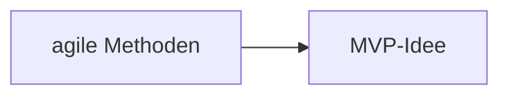
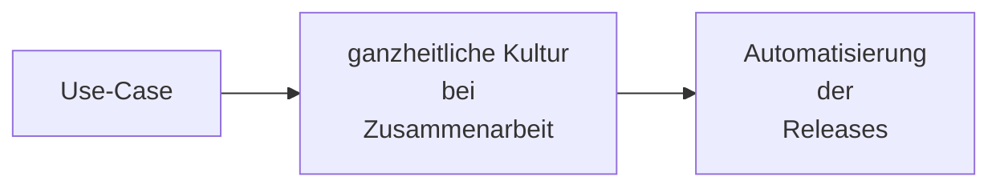

... als Schlüssel für Geschwindigkeit

# DevOps
> DevOps ist eine Sammlung unterschiedlicher technischer Methoden und eine Kultur zur Zusammenarbeit zwischen Softwareentwicklung und IT-Betrieb. DevOps soll durch gemeinsame Prozesse und Software-Werkzeuge eine effektivere und effizientere Zusammenarbeit der Bereiche Softwareentwicklung (Dev),  Systemadministratoren (Ops), aber auch Qualitätssicherung und der Nutzerschaft ermöglichen. Mit DevOps sollen die Softwarequalität, die Geschwindigkeit der Entwicklung und der Auslieferung, sowie das Miteinander der beteiligten Teams verbessert werden.
> --- [Wikipedia](https://de.wikipedia.org/wiki/DevOps)

- DevOps = Developer + Operations
	- Kombination
	- Philosophie + Methode

# Agile Softwareentwicklung
> Agile Softwareentwicklung bezeichnet Ansätze im Softwareentwicklungsprozess, die die Transparenz und Veränderungsgeschwindigkeit erhöhen und zu einem schnelleren Einsatz des entwickelten Systems führen sollen, um so Risiken und Fehlentwicklungen im Entwicklungsprozess zu minimieren. Dazu wird versucht die Entwurfsphase auf ein Mindestmaß zu reduzieren und im Entwicklungsprozess so früh wie möglich zu ausführbarer Software zu gelangen. Diese wird in regelmäßigen, kurzen Abständen mit dem Kunden abgestimmt. So soll es möglich sein, flexibel auf Kundenwünsche einzugehen, um so die Kundenzufriedenheit insgesamt zu erhöhen.
> --- [Wikipedia](https://de.wikipedia.org/wiki/Agile_Softwareentwicklung)

wichtige Begriffe in der agilen Softwareentwicklung:

| Kürzel | Begriff |
| :------ | :------- |
| CI | Continuous Integration |
| CD | Continuous Deployment |
| | Code-Qualität |
| | Robustheit |

## Herangehensweise

- messbare Kriterien:
	- fehlgeschlagene Builds
	- Abdeckung des Quelltexts mit Tests
	- Teamgeschwindigkeit
- Ziel: **DINGE sichtbar machen!**