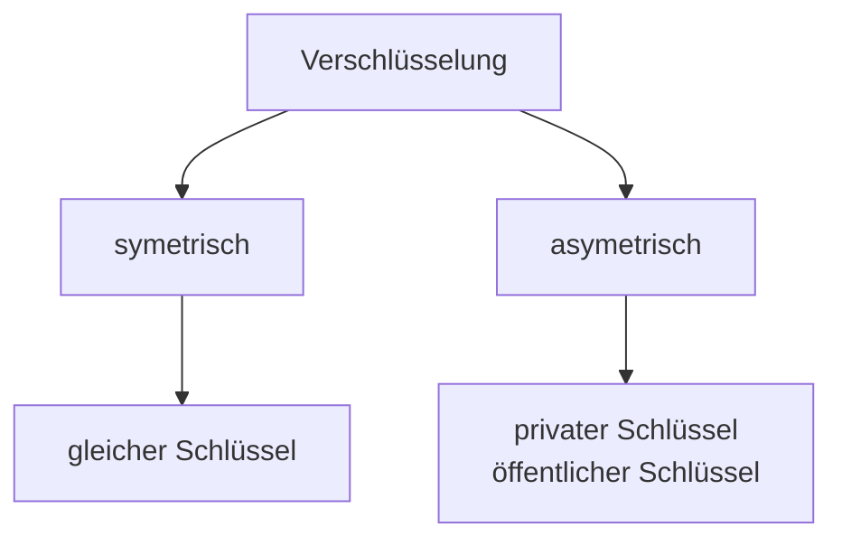

# HASH-Funktion
![[HASH-Fkt.drawio.svg]]
- Hash-Funktionen
	- SHA256
	- MD1, MD5
	- Whirlpool
	- SHA-1, SHA-2, SHA-3
	- rot=nicht mehr sicher
- Verwendung bei:
	- Passwort-Speicherung
	- Integritätsprüfung  
![[HASH_Integritaet.drawio.svg]]
- **Beispiel:** Passwort der Länge 8, Zeichen a...z (26 Zeichen), A...Z (26 Zeichen), sowie 10 Sonderzeichen
	- $26+26+10=62$
	- $62^8$ Möglichkeiten (für das Passwort)
- Rainbow-Table:  

| Passwort | Hashwert | 
| :-------: | :--------: |
| 1 | . | 
| . | . |
| . | . |
| . | . |
| . | . |
| . | . |
| $62⁸$ | . |

- z.B. 1000 Hash-Werte pro Sekunde
	- $2.18*10^{11}$ Sekunden ==> 5923 Jahre
	- 100 Rechner, pro Rechner 100000 Hashwerte ==> 25 Tage

## Verschlüsselung

### symmetrische Verschlüsselung
![[Symmetrische_Verschluesselung.drawio.png]]
- Algorithmus:
	- schnell
	- durch Hardware beschleunigbar

### asymmetrische Verschlüsselung
- Algorithmus
	- langsamer
	- schlecht durch Hardware zu beschleunigen
- **Grundidee**:
	- habe 2 Schlüssel
		- privater Schlüssel
		- öffentlicher Schlüssel
	- "Dateien", die mit dem öffentlichen Schlüssel verschlüsselt werden, können nur noch mit dem privaten Schlüssel entschlüsselt werden
![[asymmetrische_Verschluesselung.png]]

## Digitale Signaturen
- Online-Version der händischen Unterschrift
- Kombination aus:
	1. HASH
	2. Unterschrift des Absenders
- Ziel: Gewährleistung der Authentizität

### Ablauf
![[Digitale_Signatur.drawio.png]]
1. Hash-Wert gebildet
2. Hash-Wert verschlüsselt mit private key
3. TXT mit verschlüsseltem HASH übertragen
4. verschlüsselten HASH-Wert mit public key entschlüsselt
5. passt dieser HASH-Wert zum übertragenen Text?

## Digitales Zertifikat
- wird benötigt, um zu bestätigen, dass der öffentliche Schlüssel von mir ist.
- **Problem**: Man-In-The-Middle Attacken
![[Man_in_the_Middle.drawio.png]]
  - **Lösung für das Problem:** öffentliche Zertifikate + Public Key Infrastructure PKI
  - digitales Zertifikat $\widehat{=}$ Personalausweis
  - digitale Signatur $\widehat{=}$ Unterschrift
  - öffentlicher Schlüssel ist echt: wird durch andere **Instanz** bestätigt:
	  - Instanz ist vertrauenswürdig, weil von übergeordneter Instanz bestätigt wurde, dass diese vertrauenswürdig ist
		  - Baumstruktur  
![[Zertifikate_Infra.drawio.png]]

## Blockchain
![[Blockchain.drawio.png]]
- Blockchain: 
	- digitales Protokoll für Transfer + Aufbewahrung von digitalen Informationen
	- dezentrale Datenbank, die ganz oft dupliziert wurde
	
| Vorteile | | Nachteile |
| :------ | :---: | :------ |
| dezentral (von zentrale unabhängig) | Eigenverantwortung | Größe
| kompletter Log aller Transaktionen | | im Allgemeinen wird Blockchain mit Bitcoin gleichgesetzt
| Rückverfolgbarkeit | | Energieaufwand |

