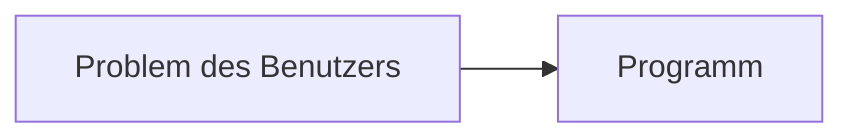
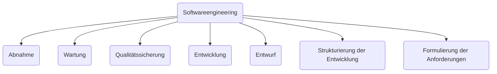

## Lösungsfindung

- Was möchte der Nutzer?
- Woher kommt die Problembeschreibung?
- Beschreibt Sie wirklich das Problem des Benutzers?

### Strukturierung des Problems: USER-Story-Format
| | Beispiel |
| :--- | :---|
| Als ... | Mensa-Koch |
| möchte ich ... | eine Inventarverwaltung |
| um ... | die Bestände im Lager verwalten und prüfen zu können |
- wenn nicht direkt vorhanden:
	- selber formulieren
	- einfordern

### weitere Schritte
- Struktur des Programms (ist dem Nutzer meistens egal)
- Korrektheit --> TESTEN
- neue Anforderungen => ?
- mehrere Entwickler
	- Wie Problem aufteilen?
	- Wie koordinieren?

## Softwareengineering

### Regeln für die Softwareentwicklung
1. Klartext
	- **Beispiel: Wasserfallmodell**
		- lineares Modell
		- Lastenheft (Was möchte ich?)
		- Pflichtenheft (Was habe ich verstanden?)
	- **Beispiel: Agil**
		- iteratives Modell
		- feste Struktur / klare Regeln (adaptierbar)
![[media/pi/modules/Systemanalyse/einfuehrung/AGIL_Backlog.png]]
![[media/pi/modules/Systemanalyse/einfuehrung/AGIL_Kommunikation.drawio.png]]
2. Gründlichkeit in der Vertragsgestaltung
	- **Beispiel: Wasserfallmodel**
		- $\frac{1}{2}$ Jahre rechtssichere Formulierng
		- Begriffe erklären
		- **Unterschrift!!!**
	- **Beispiel: Agil**
		- Backlog + Refinement
	- Warum wichtig? (Beispiel was sonst passieren kann):
		- Beispiel: Quadrat mit 3 Strichen  
![[media/pi/modules/Systemanalyse/einfuehrung/AGIL_Kommunikation_II.drawio.png]]
3. wandelnde Anforderungen: Wie gehe ich damit um?

### Workflow in der AGILEN Entwicklung
![[media/pi/modules/Systemanalyse/einfuehrung/AGIL_Workflow.drawio.png]]

### Minimal Viable Product (MVP)
![[media/pi/modules/Systemanalyse/einfuehrung/MVP.png]]
--> nach der ersten Iteration gibt es (bei dem MVP) schon ein funktionierendes Produkt, das mit jeder Iteration den Ansprüchen des Kunden entgegenkommt.

### Phasen der Softwareentwicklung
1. Anforderungen + Planung
2. Analyse + Definitionen
3. Entwurf (Design-Phase)
4. Realisierung + Modul-Tests
5. Integration + System-Tests
6. Auslieferung + Akzeptanz-Tests
7. Wartung  
--> für MVP: Durchführung der einzelnen Phasen für die einzelnen MVPs

### Softwareentwicklung
1. Es existieren Entwicklungs**phasen** (zeitlich befristete Abschnitte für bestimmte Aufgaben)
2. Vorgehensmodelle (Leitfäden für Softwareentwicklung)
	- standardisierte Vorgensweisen in bestimmten Phasen  
![[media/pi/modules/Systemanalyse/einfuehrung/Softwareentwicklung_STACK.drawio.png]]
