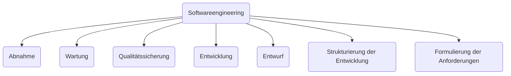

## Lernzielkontrolle 01

### Definition Software-Engineering

### Phasen der SW-Entwicklung
1. Anforderungen + Planung
2. Analyse + Definitionen
3. Entwurf (Design-Phase)
4. Realisierung + Modul-Tests
5. Integration + System-Tests
6. Auslieferung + Akzeptanz-Tests
7. Wartung  
--> für MVP: Durchführung der einzelnen Phasen für die einzelnen MVPs

### Unterschied SW-Entwicklungsphasen und SW-Entwicklungsmodellen
> Die einzelnen SW-Entwicklungsphasen werden in den jeweiligen Entwicklungsmodellen angewendet. Die Modelle unterscheiden sich im Ablauf, der Art und Weise der Bearbeitung, der Wiederholung der Phasen und teilweise auch um einige Extra-Teilphasen, sowie den Übergängen zwischen den Phasen.

### Beispiel MVP
>nach der ersten Iteration gibt es (bei dem MVP) schon ein funktionierendes Produkt, das mit jeder Iteration den Ansprüchen des Kunden entgegenkommt.
![[media/pi/modules/Systemanalyse/einfuehrung/MVP.png]]
> Der Nutzer hat ein Auto gefordert, um seinen Kasten Bier zu transportieren, das ließe sich aber schon mit einem einfachen Skateboard realisieren, weshalb dieses hier als MVP gilt. Alle weiteren Iterationen wie der Roller, das Fahrrad und das Moped führen dann an die eigentliche Lösung heran. 

### MMM-Prinzip
![[media/pi/modules/Systementwicklung/3M-Modell.drawio.svg]]
> Das 3M-Prinzip soll die Fehlersuche vereinfachen und zwar sollte man den Fehler immer beim ersten M(ensch) suchen, dann zum zweiten M(aschine) weitergehen und sich erst am Ende um das dritte M(ethode) zu kümmern.

### Regeln der Software-Entwicklung
1. Klartext
	- **Beispiel: Wasserfallmodell**
		- lineares Modell
		- Lastenheft (Was möchte ich?)
		- Pflichtenheft (Was habe ich verstanden?)
	- **Beispiel: Agil**
		- iteratives Modell
		- feste Struktur / klare Regeln (adaptierbar)  
![[media/pi/modules/Systemanalyse/einfuehrung/AGIL_Backlog.png]]
![[media/pi/modules/Systemanalyse/einfuehrung/AGIL_Kommunikation.drawio.png]]
2. Gründlichkeit in der Vertragsgestaltung
	- **Beispiel: Wasserfallmodel**
		- $\frac{1}{2}$ Jahre rechtssichere Formulierng
		- Begriffe erklären
		- **Unterschrift!!!**
	- **Beispiel: Agil**
		- Backlog + Refinement
	- Warum wichtig? (Beispiel was sonst passieren kann):
		- Beispiel: Quadrat mit 3 Strichen  
![[media/pi/modules/Systemanalyse/einfuehrung/AGIL_Kommunikation_II.drawio.png]]
3. wandelnde Anforderungen: Wie gehe ich damit um?

### DOD und DOR
- DOD = Definition of Done
- DOR = Definition of Ready
#### Definition of Done (DoD)
- Checkliste
- Festlegung wann Einzelaufgabe erledigt ist
- Ziel: Qualitätssteigerung
- Synthese aus TEAM-Anspruch und Unternehmens Quality Management
- Wann bin ich mit jeder Einzelaufgabe fertig?
- Struktur:
	- falsch:
		-  [ ] Nutzer hat Lösung gesehen
	- richtig:
		- [ ] Nutzer: \_\_\_\_ am: \_\_\_\_ hat 

**Aufbau:**

| Kategorie | Aufgaben | leicht messbare Kriterien |
| :--------: | :--------- | :----------- |
| A | 1)\_\_\_\_    2)\_\_\_\_    3)\_\_\_\_ | Nutzer \_\_\_\_ am \_\_\_\_  Anzahl der Rückfragen \_\_\_\_
| B | 1)\_\_\_\_  2)\_\_\_\_   3)\_\_\_\_  | |
| C | 1)\_\_\_\_  2)\_\_\_\_  3)\_\_\_\_| |

#### Definition of Ready (DoR)
- Dokumente gehören dem Team!
- Wann kann ich mit einer Einzelaufgabe anfangen (wieder auf jede Karte anwendbar!)
- Aufbau: 

| Kategorie | Aufgabe | leicht messbare Kriterien | 
| :----- | :------ | :------ |
| | | |
| | | |
| | | |
| | | |
| | | |
| | | |
| | | |

### USER-Story
| | Beispiel |
| :--- | :---|
| Als ... | Mensa-Koch |
| möchte ich ... | eine Inventarverwaltung |
| um ... | die Bestände im Lager verwalten und prüfen zu können |
- wenn nicht direkt vorhanden:
	- selber formulieren
	- einfordern

## Lernzielkontrolle 02
--> siehe [[Phasenmodell]]

### Motivation Wasserfallmodell --> iteriertes Phasenmodell
> Beim Wasserfallmodell muss beim Scheitern in einer gewissen Phase, der gesamte vorhergegangene Fortschritt verworfen werden und es muss von vorne angefangen werden.
> Das iterierte Phasenmodell erlaubt es einen Schritt in der Entwicklung zurück zugehen, um Fehler zu beheben.

### Unterscheidung Prototyp - Pretotype
- Prototypen zum Testen der Akzeptanz
	- (Prototyp muss verworfen werden!)
	- Nutzer müssen wissen, dass es sich um einen Prototypen handelt
	- Def.: erstes Vorbild
		- praktische Erfahrungen für Nutzer möglich
		- Klärung von Anforderungen
		- zeigt wesentliche / ausgewählte Eigenschaften
		- darf QUICK AND DIRTY sein

- Versuch: Erstellung eines Pretotypen
	- "Fake it before you make it"
	- Bsp.: Entwicklung des PDA --> Pretotyp = Holz / Kartonbox mit einem Blattpapier und Bleistift
	- Bsp.: Entwurf von Benutzer-Oberflächen mit Bleistift und Papier
		- ergänzend können weitere Seiten entworfen werden, die zeigen wie auf Input reagiert wrid
		- **`FAIL EARLY`**

### 5 Grundprinzipien des Design-Thinkings
| Inspiration | Ideen | Testen | Machen |
| :---------- | :---- | :----- | :----- |
| verstehen (Interviews) | Ideen finden | Pretotype | machen nicht nur drüber reden |
| beobachten (direktes Beobachten des bisherigen Ablaufs) | bekannte Dinge verknüpfen | Prototype | |
| Was soll entwickelt werden? | | Tests | |
| Für wen soll entwickelt werden? | | | |
| Rahmenbedingungen, Endzustand | |

#### Hinweise
1. Kundenorientierung
2. bildlich erarbeitet
3. Qualität der Ideen steht im Vordergrund
4. früh und oft scheitern
5. wilde Ideen zulassen

## Lernzielkontrolle 03
### Nutzen einer Retrospektive
- Lernen aus eigenen Fehlern
- Verbesserung von Planung / Schätzungen
- Anpassung/Weiterentwicklung des Prozesses

### Vorteile einer Retrospektive
siehe [[studies/Systemanalyse/topics/Prüfungsvorbereitung#Nutzen einer Retrospektive|Retrospektive]]

### Leitung einer Retrospektive
- SCRUM-Master

### Elemente einer Retro-Veranstaltung
![[media/pi/modules/Systemanalyse/vorgehensmodelle/scrum/Retrospektive.drawio.svg]]

### Was und wieviel muss nach dem Clustern der Impediments erzeugt werden?
- Was sind Impediments?
- Was ist mit der Frage gemeint?

### empfohlene Häufigkeit einer Retro
- beim SCRUM nach einem Sprint und vor dem Sprint-Review-Event
- bei anderen Vorgehensmodellen ==> nach dem Durchlaufen des jeweiligen Modells / (vllt. alle paar Monate)
- nochmal bei Kasche fragen!

## Lernzielkontrolle 04
### Quadranten des Spiralen-Modells
siehe [[Spiralenmodell]]

### Entwicklungsablauf beim Spiralenmodell
siehe [[Spiralenmodell]]

### Zielkriterien für Entwicklungsmodelle
- Strukturierung des Entwicklungsprozesses
- höherer Testintervall
- schnelles Fehlerfinden
- Koordinierung mehrerer Entwickler
- schnelles Eingehen auf neue Anforderungen
- Kasche fragen!

### V-Modell und seine Vorteile
siehe [[V-Modell]]

### Das XT beim V-Modell-XT
- XT = eXtreme Tailoring
	- Vorgehensbausteine aus dem V-Modell selber aussuchen
	- _"Das Modell für die eigenen Anforderungen zuschneiden"_

### Bausteine, 4 Projekt-Typen und Durchführungsstrategien beim V-Modell-XT
Kasche fragen!
- Bausteine:
	- Projektmanagement
	- Qualitätssicherung
	- Konfiguraitonsmanagement
	- Problem- und Änderungsmanagement
	- Systemerstellung
	- Anforderungsfestlegung
	- Lieferung und Abnahme
	- Vertragsschluss
	- Einführung und Pflege eines organisationsspezifischen Vorgehensmodells
- 4 Projekt-Typen:

| Auftrag-Geber (AG) | Auftrag-Nehmer (AN) | AG / AN | orga-spezifisches Vorgehensprojekt |
| :-----: | :-----: | :------: | :------: |
| z.B. Vergabe von Entwicklungsauftrag | Entwicklung | kein offizielles Vertragsverhältnis z.B. Fachabteilung + Entwickler | |
	- außerhalb meines eigenen Projektes existieren viele PRODUKTE
	- Fertigstellung + Übergabe durch Kommunikationspfade festgelegt
	- Es muss beantwortet werden: **Wer macht, wann, was?**
- Durchführungsstrategien
	- prototypische Systementwicklung
	- Inkrementelle Systementwicklung

### 3 Säulen des V-Modell-XT
![[media/pi/modules/Systemanalyse/vorgehensmodelle/v-modell/VModellXT_Saeulen.png]]
- produktorientiert: nicht WIE, sondern WAS hergestellt wird, muss spezifiziert werden
	- USER-STORY-Format
- Produkte:
	- Software
	- Modelle
	- Dokumentation
	- Zwischen Ergebnisse
- Es gibt Entscheidungspunkte (Meilensteine) für alle Produkte

### eXtreme Programming
siehe [[Extreme Programming]]

## Lernzielkontrolle 05
### empirische Prozesskontrolle
- Beispiel: Magic Ball
	1. jeder berührt den Ball direkt
	2. Ball muss zwischendurch in der Luft sein
	3. keine direkte Übergabe in die Hand des Nachbarn
		--> Schätzungen der schaffbaren Runden waren anfangs extrem unrealistisch, später relativ genau

### Plan->Do->Check->Act (PDCA)
![[media/pi/modules/Systemanalyse/vorgehensmodelle/scrum/PDCA.drawio.svg]]   
--> Schätzfähigkeit erhöht sich durch PDCA

## Ablauf SCRUM
siehe [[SCRUM]]

### Rollen und Aufgaben
siehe [[SCRUM]]

### Events im SCRUM
siehe [[SCRUM]]

### Pairing-Tabelle
siehe [[SCRUM]]

### Grund für die Nutzung von DOD und DOR
--> Qualitätssteigerung
--> Bewertung des Arbeitsaufwandes einzelner Aufgaben

### SCRUM-Manifest
siehe [[SCRUM]]

### Kanban-Board
- Visualisierung des Arbeitsflusses
- Begrenzung der Arbeit / (des Workloads des Teams)
- Pull-Prinzip
	- _kann ich Karte wirklich schon rüber ziehen?_
	- _Habe ich alles beendet was zu dieser Karte gehört?_
- Organisation und Priorisierung von Aufgaben
- Verfolgung der Arbeit
- Koordination von Teammitgliedern

### STORY-Board
siehe [[STORY-Board]]

## Lernzielkontrolle 06
### Monatsaufgaben eines SW-Entwicklers
Kasche fragen!
1. Anforderungsanalyse
2. Softwareentwicklung
3. Fehlerbehebung und Debugging
4. Code-Reviews
5. Teamkommunikation und Zusammenarbeit
6. Dokumentation
7. Fortbildung und Weiterentwicklung

### Teufelsquadrat
![[media/pi/modules/Systemanalyse/aufwandsanalyse/teufelsquadrat-l.png]]
- Zieldefinition bei Projektstart
- Steuerung von Änderungen

### Faktoren zur Beeinflussung einer Aufwandsschätzung
![[media/pi/modules/Systemanalyse/aufwandsanalyse/Schaetzfaktoren.svg]]

### empirische Schätzverfahren
siehe [[Aufwandsanalyse]]

### Delphi-Methode und SCRUM-Poker vergleichen
siehe [[Aufwandsanalyse]]

### algorithmische Schätzverfahren
siehe [[Aufwandsanalyse]]

### Schwachstelle CoCoMo und Function-Point-Methode
- CoCoMo:
	- Einschätzung anhand Lines of Code ist schwierig
	- keine gute Schätzmethode
- Function-Point-Methode:
	- Kasche fragen!
	- hoher Zeitaufwand für die Schätzung
	- Kategorisierung von Funktionen teilweise Schwierig
	- begrenzte Berücksichtigung von Faktoren außerhalb der funktionalen Größe