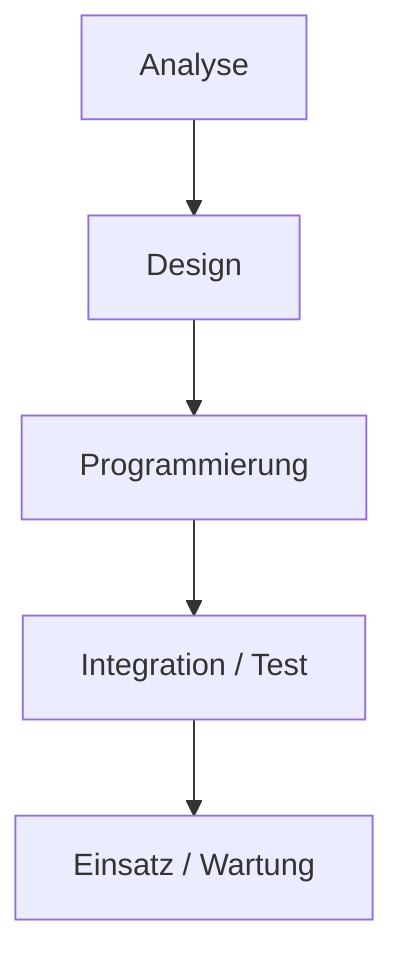
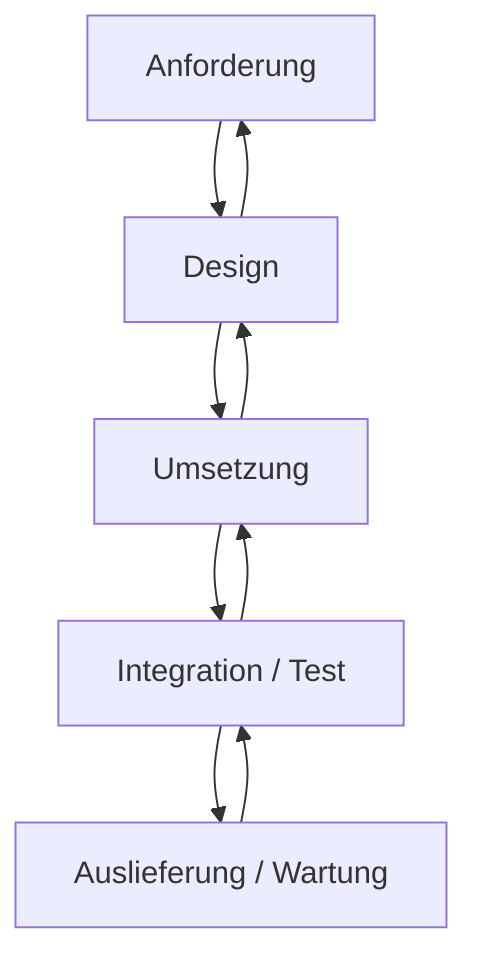

## Phasenmodell (Wasserfallmodell)

### 2.1.1. Analyse-Phase
- Bestimmung des Funktionsumfangs
- User-Interface
- Leistungsverhalten
- Termine
--> **Ergebnis:** Lastenheft
--> **Problem:** Fehlerfortpflanzung

### 2.1.2. Design-Phase
- innere Struktur der Software nach Produktdefinition  
--> Zerlegung in Komponenten  
--> **Ergebnis:** Pflichtenheft

### 2.1.3. Programmierung
- Implementierung der Komponenten anhand des Entwurfs
- Programmieren im Kleinen  
--> einzeln getesten Module (sind noch nicht lauffähig)

### 2.1.4. Integrations- und Test-Phase
- nacheinander werden Einzelkomponenten hinzugefügt
- weitere Tests
- Abnahme-Tests
- Installation  
--> Gesamtsystem, mit abschließenden Systemtest, der Konsistenz zur Produktdefinition prüft

### Vor- und Nachteile
| Vorteile | Nachteile |
| :------- | :-------- |
| wenige/einfache Schritte  klare Struktur Ende des Projektes fixiert/absehbar weniger komplex | Anforderungsänderungen nicht möglich MVP fehlt Wissenstransfer nicht unterstützt ohne Rückkopplungen kein experimentelles Vorgehen Testen erst am Ende |

## iteriertes Phasenmodell

--> hat sich nicht durchgesetzt
