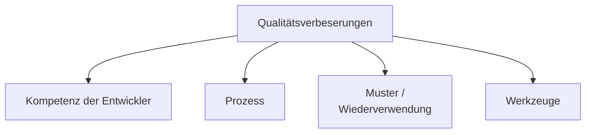
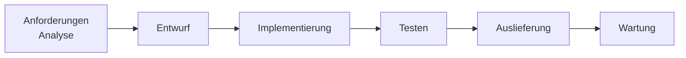

## 3M-Modell
![[media/pi/modules/Systementwicklung/3M-Modell.drawio.svg]]

## Phasen in der Softwareentwicklung

## Automatisierung
- DevOps, CI/CD, CT, Codegenerator

### Codegenerator
![[media/pi/modules/Systementwicklung/Codegenerator.drawio.svg]]

### Template-Funktionen
`LIST<DHGE>`

### Round-Trip-Engineering
![[media/pi/modules/Systementwicklung/Round-Trip-Engineering.drawio.svg]]

### Plattform-Independent-Model
![[media/pi/modules/Systementwicklung/PIM.drawio.svg]]