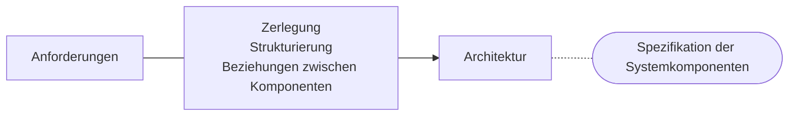
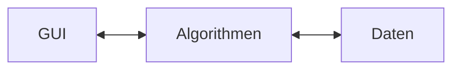

# 1.1. SW-Entwurf
| Phase | Frage |
| :-----  | :---- |
| Formulierung der Anforderung<br>Analyse | Was |
| Design | Wie |
| Umsetzung<br>Test<br>Auslieferung / Wartung | |

## Hauptaufgabe des System-Entwurfs


## Subsystem
- in sich geschlossenes System
- eigenständig funktionsfähig
- definierte Schnittstellen
- besteht wieder aus Komponenten

![[media/pi/modules/Systementwicklung/Subsystem.drawio.svg]]

## Komponenten
- Bausteine für Software-System
- benutzt andere Komponenten
- wird von anderen Komponenten benutzt
- besteht aus Unterkomponenten

# 1.2. Gliederung des Entwurfsprozesses
- Grob-Entwurf:
	1. Architektur entwerfen
	2. Subsysteme entwerfen
	3. Schnittstellen festlegen
	- (bisher unabhängig von Implementierungssprache!)
- Fein-Entwurf:
	4. Komponenten
	5. Datenstrukturen
	6. Algorithmen

![[media/pi/modules/Systementwicklung/Entwurfprozess.drawio.svg]]

## Standardarchitektur - 3 Schichtenmodell
![[media/pi/modules/Systementwicklung/3-Schichtenmodell.drawio(1).svg]]

## Beispiel mit Architekturtypen
### Beispiel
Service-Techniker, will auf **mobilem Gerät** oder **Web-Applikation**:
1. Auftragsschein ausfüllen, unterschreiben lassen, in DB speichern
2. aus Reihe von Dienstleistungen vor Ort Kunden eine Preisaussage ermöglichen
3. ggf. eine Angebotserstellung starten lassen

#### 0. Kunde
![[media/pi/modules/Systementwicklung/0_Arch_Kunde.drawio.png]]

#### 1. physikalische Sicht
![[media/pi/modules/Systementwicklung/1_Arch_physisch.drawio.png]]

#### 2. Programmierer

oder: siehe <span style="color: red">Till's Lösung - MUSS NOCH ERGÄNZT WERDEN!</span>

#### 3. Ablauf / Vorgang
![[media/pi/modules/Systementwicklung/3_Arch_Ablauf.drawio.png]]

#### 4. logische Sicht (Nutzer)
```mermaid
%%{'theme':'forest'}%%

flowchart TD
A([START]) --> B{Service?}
B -- Angebot --> U1[[UP1]]
B -- Auftrag --> U2[[UP2]]
B -- Preisabfrage --> U3[[UP3]]
B -- Einstellungen --> U4[[UP4]]
U1 --> C{Ende?}
U2 --> C
U3 --> C
U4 --> C
C -- Nein --> A
C -- Ja --> D(((STOP)))
```

#### Fragen
1. Für WEN ist die Darstellung?
2. Korrekt
3. vollständig / präzise
4. Gruppierung (Kohäsion)
5. ausreichende Trennung (Kopplung)

## 1.4. Software-Architektur
beschreibt die grundlegende Organisation eines Systems.
--> verkörpert, durch:
- seine Komponenten
- ihre Beziehungen zueinander
- Beziehung zur Umgebung

![[media/pi/modules/Systementwicklung/Software-Architektur.drawio.svg]]

- beruht auf allgemeinen:
	- Entwicklungsprinzipien
	- Heuristiken
	- Architektur-Mustern
- ==> dient der Dokumentation

![[media/pi/modules/Systementwicklung/Szenarien.svg]]

## 1.5. Kriterien für einen guten Entwurf
1. Verständlichkeit + Präzision
2. Anpassbarkeit
	- Inhalt
	- Darstellung
3. Korrektheit + Vollständigkeit
4. Wiederverwendbarkeit
5. hohe Kohäsion (Maß für Zusammengehörigkeit)
6. schwache Kopplung
	- (z.B. große Klassen in kleinere Aufbrechen)

Was sind funktionale Anforderungen?
- schönes Aussehen
- Anfänger freundlich
- schnell
- usw.

### hohe Kohäsion
Zusammenfassung gleichartiger Dinge in Funktionen (heute: Objektorientierung)
- Paketbildung anstreben
- kohärente Klasse
	- ausreichen verschränkt / zusammenhängend
	- keine Untergruppierung von Methoden + Attributen vornehmbar

### Kopplung
Maß für die Abhängigkeit zwischen Komponenten.
1. Strukturelle Kopplung
	- Gegensteuerung: keine Vererbung über Paketgrenzen hinweg
2. Schnittstellen
	- eine Möglichkeit: Objekt-Übergabe
3. Daten
	- z.B. auf Datenelement direkt zugreifen
	- Lösung `getter / setter` d.h. KAPSELUNG

niedrige Kopplung:
- höhere Unabhänigkeit
- höhere Skalierbarkeit
- höhere Stabilität
- höhere Wartbarkeit

### Wiederverwendung
Maß für Ausnutzung von Gemeinsamkeiten
- niedrige Redundanzen
- höhere Stabilität

Hilfsmittel:
- Objektorientierte Programmierung
- allgemeine Schnittstellen

## 1.6. Software-Architektur und deren Sichten
![[media/pi/modules/Systementwicklung/4+1_Sichten_Modell.drawio.svg]]
- Verbindung zwischen den Schichten wird durch SZENARIEN ermöglicht
- Hilfsmittel zur Darstellung von SZENARIEN:
	- USER-Story
	1. verschiedene Sichten integrieren
	2. Kriterien für Architektur-Bewertung
		- alternative Architektur => Auswahl
	3. Qualitätssicherung

direkte Szenarien: sofort umgesetzt / erfüllt
indirekte Szenarien: erst nach einer Erweiterung realisierbar

==> Zähle die Szenarien:
- direkte Szenarien: ---
- indirekte Szenarien: ---
- nicht-erfüllbare Szenarien: ---  
==> Aufwandsausssagen / Effizienzschätzungen  