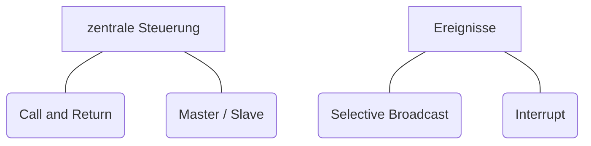

- Definition von nebenläufigen Systemeinheiten
- Steuerung vo nAbläufen von Einzelfunktionen
- auf Ereignisse reagieren
- Synchronisation bzw. Koordination

## Sequenzdiagramme

### Master / Slave
![[media/pi/modules/Systementwicklung/Master_Slave.drawio.svg]]
- Vorteil: zentrale Stelle
- Nachteil: zentrale Stelle (kann ausfallen)

### Call and Return
![[media/pi/modules/Systementwicklung/Call and Return.drawio.svg]]
- Vorteil: 
	- jedes Programm hat eigene Authorität
	- gut für Objektorientierte Programmierung
- Nachteil:
	- keine zentrale Stelle

### Selective Broadcast
![[media/pi/modules/Systementwicklung/Selective Broadcast.drawio.svg]]
- Vorteil: zentrale Stelle
- Nachteil: viele Informationen an einer Stelle gebündelt

### Interrupt
![[media/pi/modules/Systementwicklung/Interrupt.drawio.svg]]
- Vorteil: zentrale Stelle
- Nachteil: viel gebündelte Information