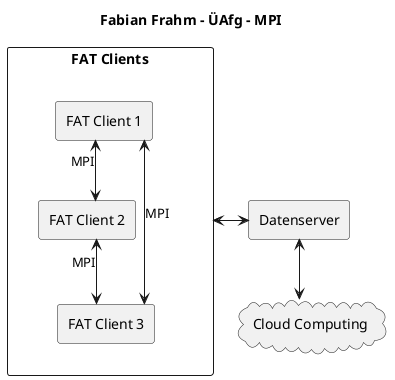
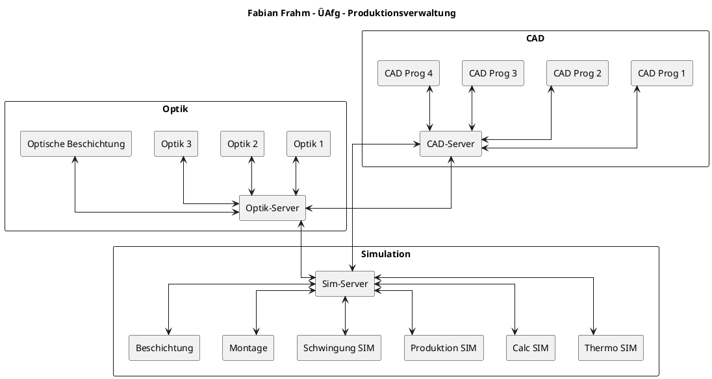
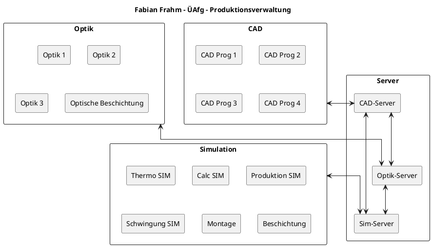

- für Admins
- Aufteilung der verschiedenen Funktionen auf Knoten eines Netzwerkes  
![[media/pi/modules/Systementwicklung/phys_Schicht.drawio.svg]]
## Architektur-Muster für die strukturelle Sicht
- zentrales System
- Client-Server
- Föderation
- Konfigurationsdiagramme

### zentrales System
![[media/pi/modules/Systementwicklung/zentrales_System.drawio.svg]]
- z.B. Kassensystem, Linux + SSH, klassischer Großrechner

### Client-Server
![[media/pi/modules/Systementwicklung/Client-Server.drawio.svg]]

#### Clients
| THIN Clients | THICK / (FAT) Clients | 
| :------ | :------ |
| nur UI | mehr eigenständige Aufgabenabarbeitung |
| "Server Scrapping" (RDP, VNC) | Serverentlastung |

##### ÜAfg - 1
1. FAT-Clients
2. Datenserver
3. MPI möglich (MPI = Message Parsing Interface)
4. Cloud Computing  

--> Gesucht ist eine System-Entwurfsidee in PlantUML

Lösung:

#### Message Parsing Interface
![[media/pi/modules/Systementwicklung/MPI.drawio.svg]]

#### Three Tier Client Server
![[media/pi/modules/Systementwicklung/Three_Tier_CS.drawio.svg]]

### Föderation
- gleichberechtigte Partner (Peer-to-Peer-NW)
- Subsysteme die miteinander Kommunizieren  
![[media/pi/modules/Systementwicklung/Föderation.drawio.svg]]
- Anzahl der Verbindungen:  
  $\frac{n*(n-1)}{2}=\text{Anzahl der Verbindungen}$  
  $n = \text{Anzahl der Knoten}$

#### ÜAfg - 2
![[media/pi/modules/Systementwicklung/UE_Foederation.drawio.svg]]  
- 14 Teilnehmer-Programme  
- Aufgabe:
	- Darstellung in PlantUML
	- Vermeidung von 91 Konvertern (aka Verbindungen)

Lösung - 1:  

Lösung - 2:

### Konfigurationsdiagramme 
- weit verbreitetes Hilfsmittel zur Beschreibung von Systemkomponenten
- nicht UML! (teilweise von PlantUML-Programm unterstützt)  
![[media/pi/modules/Systementwicklung/Konfigurationsdiagramm.svg]]
